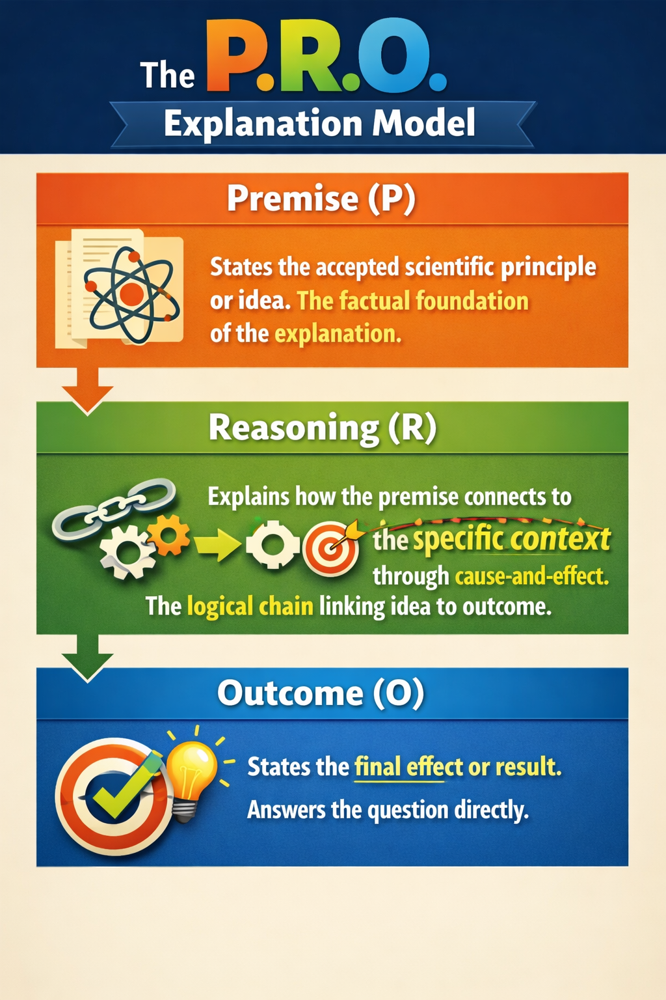

================================================
PRO Paragraph Structures
================================================

PRO (Premise-Reasoning-Outcome) paragraph structures are a common organizational pattern in scientific explanations. They consist of three main components:

.. container:: P

   .. rubric:: Premise (P)

:p:`States the accepted scientific principle or idea that applies to the situation. This is the factual foundation of the explanation.`

.. container:: R

   .. rubric:: Reasoning (R)

:r:`Explains how the premise connects to the specific context through cause-and-effect. This is the logical chain that links the idea to the outcome.`

.. container:: O

   .. rubric:: Outcome (O)

:o:`States the final effect or result that follows from the reasoning. This completes the explanation and answers the question directly.`

----

Worked Example: PRO Paragraph
-------------------------------

Consider the following questions that might be posed in a chemistry context:

- “Why does the pressure inside a container increase when a gas is heated?”
- “Explain why heating a gas causes an increase in pressure.”
- “Why does a gas exert more pressure when its temperature rises?”
- “Describe the effect of heating on the pressure of a gas in a sealed container.”
- “How does particle motion explain the increase in pressure when a gas is heated?”

All of these invite the same PRO structure:

- :p:`Heating a gas increases the kinetic energy of its particles, causing them to move faster.`
- :r:`Reasoning: As a result, the particles move more rapidly and collide with the walls of the container more frequently and with greater force.`
- :o:`Outcome: Therefore, the pressure inside the container increases.`

----

PRO Paragraph Checklist
-------------------------------

.. container:: p

   .. rubric:: Premise (P)

   :p:`Heating a gas increases the kinetic energy of its particles, causing them to move faster.`

   .. admonition:: Premise Checklist
      :class: premise

      **Premise (P) - (set the situation or fact)**

      - States a **scientific fact, principle, properties, or observation**
      - Can start with **“When…”, “A…”, “The…”, or a descriptive statement**
      - Includes the **key concept** for the explanation
      - Contains **only one main idea**
      - **Does not explain why** the outcome occurs yet

      *Test:* Can you continue naturally with **“As a result…”**?

----

.. container:: r

   .. rubric:: **Reasoning (R):**

:r:`As a result, the particles move more rapidly and collide with the walls of the container more frequently and with greater force.`

.. admonition:: Reasoning Checklist
   :class: reasoning

   **Reasoning (R) - “As a result…” (explain what happens inside)**

   - Starts with **“As a result…”**
   - Explains **what is happening at a particle/process level**
   - Clearly links back to the Premise
   - Uses simple action words (*move, collide, separate, react*)
   - Does **NOT jump to the final outcome too quickly**
   - May include **“so…”** inside the sentence if needed

   *Test:*
   Does this explain **HOW or WHY it happens**, not just WHAT happens?

----

.. container:: o

   .. rubric:: **Outcome (O):**

:o:`Therefore, the pressure inside the container increases.`

.. admonition:: Outcome Checklist
   :class: outcome

   **Outcome (O) - “Therefore…” (state the final result)**

   - Starts with **“Therefore…”**
   - States the **final observable result**
   - Clearly answers the original question
   - Is **short and direct**
   - Does **NOT repeat the reasoning**
   - Does **NOT include “because”**

   *Test:*
   Is this something you could **observe or measure**?

