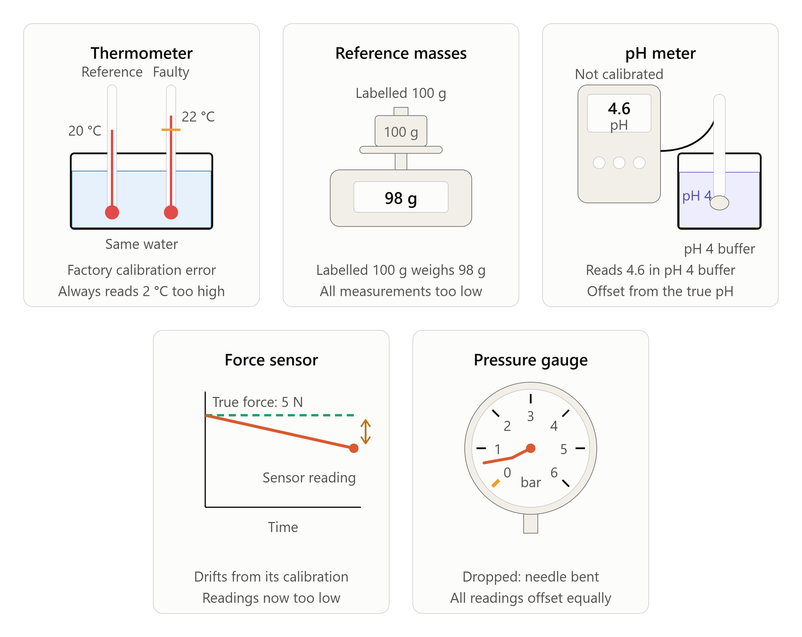

===================
Calibration Error
===================

| **Calibration error** occurs when an instrument gives readings that are consistently offset from the true value across its entire range, due to incorrect calibration or a fault in the instrument itself.
| It is classified as a **systematic error** — every reading is shifted in the same direction by a consistent or proportional amount.

----

----

Examples
------------

* A thermometer that reads 2 °C too high across its entire range due to
  incorrect calibration at the factory
* A set of masses labelled 100 g that actually weigh 98 g, causing all
  mass measurements to be consistently underestimated
* A pH meter that has not been calibrated against a buffer solution,
  giving readings that are offset from the true pH
* A force sensor that drifts over time and no longer matches its
  original calibration, giving readings that are consistently too low
* A pressure gauge that has been dropped and bent, causing all readings
  to be offset by a fixed amount

.. admonition:: Calibration Error: A Four-Step Analysis
    :class: premise

    Use the four-step framework to analyse calibration error:

    **Step 1 — Identify the source**
        *Instrumental* — the measuring device has not been correctly set
        against a known standard, or has drifted from or been damaged since
        its last calibration.

    **Step 2 — Classify the behaviour**
        Consistent, one-direction shift → **Systematic error** → affects
        accuracy. Every reading is displaced from the true value by a
        consistent or proportional amount across the instrument's range.

    **Step 3 — Explain the impact**
        All results are shifted consistently too high or too low. The error
        cannot be detected by repeating measurements, as every repeat is
        affected equally. Precision is unaffected — results will agree with
        each other — but none will reflect the true value.

    **Step 4 — Suggest an improvement**
        Calibration error is eliminated, not averaged out — verify the
        instrument against a known standard before use and recalibrate
        if necessary.

----

Effects
----------------

Calibration error produces a **consistent or proportional offset** across
all measurements. Because every reading is displaced by the same instrument
fault:

* results will appear **precise** (repeats agree with each other),
* but **accuracy is reduced** — all values are displaced from the true
  value in the same direction,
* repeating measurements does **not** help, as the error affects every
  reading equally,
* the offset may be fixed (the same amount across the range) or
  proportional (larger at higher values), depending on the nature of
  the fault.

----

Improvements
------------

To eliminate calibration error, verify instruments against a known
standard before use and recalibrate or replace them if they are found
to be faulty.

* Calibrate the instrument against a known standard before collecting
  data — for example, check a thermometer in an ice-water bath (0 °C)
  and boiling water (100 °C at sea level).
* Use buffer solutions of known pH to calibrate a pH meter before and
  during data collection.
* Record the calibration check as part of the method so the instrument's
  accuracy can be verified if results are questioned.
* If a fixed offset is known and stable, apply a correction factor to
  all readings.
* Replace or have the instrument professionally serviced if calibration
  cannot be restored.

----

Calibration Error Quiz
------------------------------------

.. admonition:: Fill in the Gaps — Calibration Error
    :class: cloze

    .. cloze::
        :instructions: Complete the following by filling in the missing words.

        1. Calibration error is classified as a @@systematic@@ error because it shifts every reading in the same direction.
        2. A calibration error reduces the @@accuracy@@ of experimental data while leaving precision unaffected.
        3. Calibration errors cannot be reduced by @@repeating@@ measurements because the offset affects every trial equally.
        4. Calibration error originates from an @@instrumental@@ source.
        5. To eliminate calibration error, an instrument must be verified against a known @@standard@@ before collecting data.

----

.. admonition:: Multiple-Choice Questions
    :class: mcq

    Choose the best answer for each question.

    .. tab-set::

        .. tab-item:: Q1

            .. multichoice::

                A thermometer reads 2 °C too high across its entire range due to incorrect factory calibration. How is this error classified?

                [ ] Random error
                [x] Systematic error
                [ ] Personal error
                [ ] Environmental variation

        .. tab-item:: Q2

            .. multichoice::

                A force sensor has drifted over time, causing every measurement to be consistently lower than the true value. What effect does this have on the experimental data?

                [ ] It decreases the precision of the measurements.
                [x] It decreases the accuracy of the measurements.
                [ ] It makes repeat readings disagree with each other.
                [ ] It introduces unpredictable random fluctuations.

        .. tab-item:: Q3

            .. multichoice::

                A student uses a pH meter that was not calibrated against a buffer solution, resulting in offset readings. They repeat the experiment three times and calculate a mean. What effect does averaging have on this calibration error?

                [ ] It completely eliminates the error.
                [ ] It reduces the error proportionally with each repeat.
                [x] It does not reduce the effect of the error.
                [ ] It converts the systematic error into a random error.

        .. tab-item:: Q4

            .. multichoice::

                What is the source category of a calibration error?

                [x] Instrumental
                [ ] Observational / Procedural
                [ ] Method
                [ ] Environmental

        .. tab-item:: Q5

            .. multichoice::

                Which of the following is the most appropriate procedure to address a potential calibration error before collecting data?

                [ ] Repeat the measurements multiple times and average the results.
                [ ] Take readings from eye level to prevent parallax offset.
                [x] Verify the instrument against a known standard and recalibrate if necessary.
                [ ] Increase the total sample size used in the investigation.

----

.. admonition:: Structured Question: Calibration Error
    :class: shortanswer

    .. structuredquestion:: Calibration Error Investigation
        :total-marks: 8
        :category: Systematic Errors

        .. stimulus::
            A Year 8 class is investigating how the weight of different objects
            compares when measured on two different spring balances. One group uses
            a spring balance that was dropped earlier in the year, bending the
            internal spring slightly. When the group hangs a 100 g standard mass
            from the spring balance, it reads **112 g**. The group does not report
            this and proceeds to use the spring balance to measure the weight of
            five different objects.

        .. tab-set::

            .. tab-item:: Part (a)

                .. subquestion:: Identify the error
                    :marks: 2

                    Identify the type of error present in this investigation and
                    classify it as random, systematic, or personal.

                    .. model-answer::
                        The error is a **calibration error** *(1 mark)*, classified as a **systematic error** *(1 mark)*.

                    .. marking-guidance::
                        Accept "calibration error" or "the spring balance is incorrectly calibrated." Do not accept "zero error" — the instrument was not giving a false zero reading, it was giving a consistently incorrect reading across its range due to physical damage. Do not accept "human error" or "mistake" — the fault is in the instrument itself.

            .. tab-item:: Part (b)

                .. subquestion:: Effect on measurements
                    :marks: 3

                    Explain how this error would affect the group's weight
                    measurements. In your answer, refer to the direction of the error and
                    its effect on the accuracy and precision of the results.

                    .. model-answer::
                        - Every measurement is consistently **overestimated** (reads higher than the true value). *(1 mark)*
                        - **Accuracy** is reduced because all recorded values are higher than the true weight. *(1 mark)*
                        - **Precision** is unaffected because the same faulty spring produces a consistent offset across repeated readings. *(1 mark)*

                    .. marking-guidance::
                        - **Direction:** Award only if overestimation is specified directly, not just "the results are wrong."
                        - **Precision:** Award only if stated as unaffected with valid reasoning. A response that states precision is reduced should not receive the mark.

            .. tab-item:: Part (c)

                .. subquestion:: Repeating measurements
                    :marks: 2

                    The group repeats each measurement three times and calculates
                    a mean. Evaluate whether this would reduce the effect of the error
                    identified in part (a).

                    .. model-answer::
                        - Repeating measurements would **not** reduce the effect of this error. *(1 mark)*
                        - Averaging does not cancel a consistent offset — it only reduces random errors that vary unpredictably between trials. *(1 mark)*

                    .. marking-guidance::
                        A response that simply states "repeating reduces error" without explaining why it does not apply here should not receive full marks. The key reasoning is that the faulty spring produces the same offset in every trial.

            .. tab-item:: Part (d)

                .. subquestion:: Improvement
                    :marks: 1

                    Describe one improvement the group could make to identify and
                    address this error before collecting data.

                    .. model-answer::
                        Verify the spring balance against a known standard mass before use, and replace the instrument if it does not read correctly. *(1 mark)*

                    .. marking-guidance::
                        Accept "apply a correction factor based on the known offset" as an alternative valid response. Do not accept "repeat measurements" as this has already been evaluated in part (c) as ineffective.
