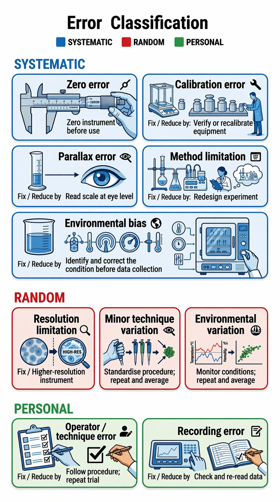

==========================================
Types of Errors in Scientific Experiments
==========================================

*Understanding error types helps evaluate the accuracy, precision, and
validity of experimental results.*

This resource uses a **two-level model**:

* **Primary classification (assessment level):**
  :P:`Systematic errors`, :R:`Random errors`, and :O:`Personal errors`
* **Secondary classification (explanation level):**
  Instrumental, observational/procedural, method, or environmental sources

----

How to Analyse Any Error: A Four-Step Framework
------------------------------------------------

Use this framework whenever you are asked to identify, explain, or evaluate
sources of error.

**Step 1 — Identify the source** *(what caused it?)*

.. list-table::
    :header-rows: 1
    :widths: 22 26 26 26

    * - Source
      - :P:`Systematic`
      - :R:`Random`
      - :O:`Personal`
    * - **Instrumental**
      - :P:`zero error`, :P:`calibration error`
      - :R:`resolution limitation`
      -
    * - **Observational / Procedural**
      - :P:`parallax error`
      - :R:`minor technique variation`
      - :O:`operator error`, :O:`recording error`
    * - **Method**
      - :P:`method limitation`
      -
      -
    * - **Environmental (variation)**
      -
      - :R:`temperature fluctuation`, :R:`vibration`, :R:`lighting variation`
      -
    * - **Environmental (bias)**
      - :P:`consistently elevated temperature`, :P:`persistent interference`,
        :P:`constant lighting offset`
      -
      -

**Step 2 — Classify the behaviour** *(how does it affect the data?)*

* Consistent, one-direction shift → :P:`Systematic error` → affects accuracy
* Unpredictable spread → :R:`Random error` → affects precision
* One-off mistake → :O:`Personal error` → discard and repeat

**Step 3 — Explain the impact**

* :P:`Systematic:` all results shifted consistently too high or too low
* :R:`Random:` results scattered around the true value
* :O:`Personal:` isolated invalid result; not representative

**Step 4 — Suggest an improvement**

* :P:`Systematic` → eliminate the source (recalibrate, redesign, correct setup)
* :R:`Random` → repeat and average; increase sample size
* :O:`Personal` → repeat the measurement or re-read the data correctly

----

Quick Reference: Error Source to Classification to Fix
----------------------------------------------------------

.. list-table::
    :header-rows: 1
    :widths: 32 16 16 36

    * - Error
      - Source Category
      - Classification
      - Fix / Reduce by…
    * - :P:`Zero error`
      - Instrumental
      - :P:`Systematic`
      - :P:`Zero instrument before use`
    * - :P:`Calibration error`
      - Instrumental
      - :P:`Systematic`
      - :P:`Verify or recalibrate equipment`
    * - :P:`Parallax error`
      - Observational
      - :P:`Systematic`
      - :P:`Read scale at eye level`
    * - :P:`Method limitation`
      - Method
      - :P:`Systematic`
      - :P:`Redesign experiment`
    * - :P:`Environmental bias`
      - Environmental
      - :P:`Systematic`
      - :P:`Identify and correct the condition before data collection`
    * - :R:`Resolution limitation`
      - Instrumental
      - :R:`Random`
      - :R:`Higher-resolution instrument`
    * - :R:`Minor technique variation`
      - Observational
      - :R:`Random`
      - :R:`Standardise procedure; repeat and average`
    * - :R:`Environmental variation`
      - Environmental
      - :R:`Random`
      - :R:`Monitor conditions; repeat and average`
    * - :O:`Operator / technique error`
      - Observational
      - :O:`Personal`
      - :O:`Follow procedure; repeat trial`
    * - :O:`Recording error`
      - Observational
      - :O:`Personal`
      - :O:`Check and re-read data`

----

.. admonition:: Multiple-Choice Questions
    :class: questions

    Choose the best answer for each question.

    1. A student consistently measures a length that is 2 mm too high due to a misaligned ruler zero point. What type of error is this?

        | a. Random error
        | b. Personal error
        | c. Systematic error
        | d. Environmental variation

    2. A thermometer gives slightly different readings each time the same temperature is measured due to small fluctuations in reading position. What is the main error type?

        | a. Systematic error
        | b. Random error
        | c. Method error
        | d. Calibration error

    3. A student misreads the meniscus of a liquid in a measuring cylinder and records the wrong value once. How should this error be classified?

        | a. Systematic error
        | b. Random error
        | c. Personal error
        | d. Environmental bias

    4. Which of the following is an example of a **systematic instrumental error**?

        | a. Random vibration affecting measurements
        | b. Consistent zero error in a balance
        | c. A one-off recording mistake
        | d. Variation in lighting conditions

    5. A scientist improves an experiment by increasing the number of repeated trials and averaging results. Which type of error is this mainly addressing?

        | a. Systematic error
        | b. Random error
        | c. Personal error
        | d. Method limitation

    .. dropdown:: Reveal Answer Key
        :icon: check-circle
        :color: success
        :class-container: sd-dropdown-container

        1. c — Systematic error
        2. b — Random error
        3. c — Personal error
        4. b — Consistent zero error in a balance
        5. b — Random error

----

.. admonition:: Multiple-Choice Questions
    :class: questions

    Choose the best answer for each question.

    .. tab-set::

        .. tab-item:: Q1
            1. A student consistently measures a length that is 2 mm too high due to a misaligned ruler zero point. What type of error is this?

                | a. Random error
                | b. Personal error
                | c. Systematic error
                | d. Environmental variation

        .. tab-item:: Q2
            2. A thermometer gives slightly different readings each time the same temperature is measured due to small fluctuations in reading position. What is the main error type?

                | a. Systematic error
                | b. Random error
                | c. Method error
                | d. Calibration error

        .. tab-item:: Q3
            3. A student misreads the meniscus of a liquid in a measuring cylinder and records the wrong value once. How should this error be classified?

                | a. Systematic error
                | b. Random error
                | c. Personal error
                | d. Environmental bias

        .. tab-item:: Q4
            4. Which of the following is an example of a **systematic instrumental error**?

                | a. Random vibration affecting measurements
                | b. Consistent zero error in a balance
                | c. A one-off recording mistake
                | d. Variation in lighting conditions

        .. tab-item:: Q5
            5. A scientist improves an experiment by increasing the number of repeated trials and averaging results. Which type of error is this mainly addressing?

                | a. Systematic error
                | b. Random error
                | c. Personal error
                | d. Method limitation

    .. dropdown:: Answers
        :icon: check-circle
        :color: success
        :class-container: sd-dropdown-container

        .. tab-set::

            .. tab-item:: Q1
                c — Systematic error

            .. tab-item:: Q2
                b — Random error

            .. tab-item:: Q3
                c — Personal error

            .. tab-item:: Q4
                b — Consistent zero error in a balance

            .. tab-item:: Q5
                b — Random error

