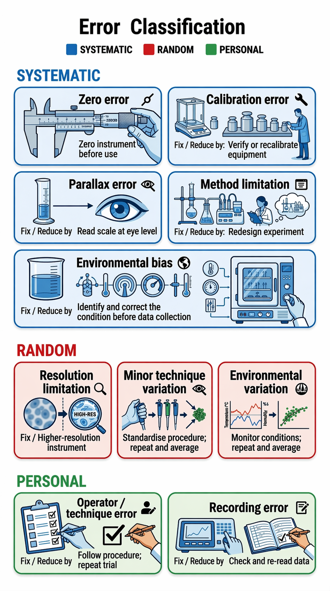

==========================================
Types of Errors in Scientific Experiments
==========================================

*Understanding error types helps evaluate the accuracy, precision, and
validity of experimental results.*

This resource uses a **two-level model**:

* **Primary classification (assessment level):**
  :p:`Systematic errors`, :r:`Random errors`, and :o:`Personal errors`
* **Secondary classification (explanation level):**
  Instrumental, observational/procedural, method, or environmental sources

----

How to Analyse Any Error: A Four-Step Framework
------------------------------------------------

Use this framework whenever you are asked to identify, explain, or evaluate
sources of error.

**Step 1 — Identify the source** *(what caused it?)*

.. list-table::
    :header-rows: 1
    :widths: 22 26 26 26

    * - Source
      - :p:`Systematic`
      - :r:`Random`
      - :o:`Personal`
    * - **Instrumental**
      - :p:`zero error`, :p:`calibration error`
      - :r:`resolution limitation`
      -
    * - **Observational / Procedural**
      - :p:`parallax error`
      - :r:`minor technique variation`
      - :o:`operator error`, :o:`recording error`
    * - **Method**
      - :p:`method limitation`
      -
      -
    * - **Environmental (variation)**
      -
      - :r:`temperature fluctuation`, :r:`vibration`, :r:`lighting variation`
      -
    * - **Environmental (bias)**
      - :p:`consistently elevated temperature`, :p:`persistent interference`,
        :p:`constant lighting offset`
      -
      -

**Step 2 — Classify the behaviour** *(how does it affect the data?)*

* Consistent, one-direction shift → :p:`Systematic error` → affects accuracy
* Unpredictable spread → :r:`Random error` → affects precision
* One-off mistake → :o:`Personal error` → discard and repeat

**Step 3 — Explain the impact**

* :p:`Systematic:` all results shifted consistently too high or too low
* :r:`Random:` results scattered around the true value
* :o:`Personal:` isolated invalid result; not representative

**Step 4 — Suggest an improvement**

* :p:`Systematic` → eliminate the source (recalibrate, redesign, correct setup)
* :r:`Random` → repeat and average; increase sample size
* :o:`Personal` → repeat the measurement or re-read the data correctly

----

Quick Reference: Error Source to Classification to Fix
----------------------------------------------------------

.. list-table::
    :header-rows: 1
    :widths: 32 16 16 36

    * - Error
      - Source Category
      - Classification
      - Fix / Reduce by…
    * - :p:`Zero error`
      - Instrumental
      - :p:`Systematic`
      - :p:`Zero instrument before use`
    * - :p:`Calibration error`
      - Instrumental
      - :p:`Systematic`
      - :p:`Verify or recalibrate equipment`
    * - :p:`Parallax error`
      - Observational
      - :p:`Systematic`
      - :p:`Read scale at eye level`
    * - :p:`Method limitation`
      - Method
      - :p:`Systematic`
      - :p:`Redesign experiment`
    * - :p:`Environmental bias`
      - Environmental
      - :p:`Systematic`
      - :p:`Identify and correct the condition before data collection`
    * - :r:`Resolution limitation`
      - Instrumental
      - :r:`Random`
      - :r:`Higher-resolution instrument`
    * - :r:`Minor technique variation`
      - Observational
      - :r:`Random`
      - :r:`Standardise procedure; repeat and average`
    * - :r:`Environmental variation`
      - Environmental
      - :r:`Random`
      - :r:`Monitor conditions; repeat and average`
    * - :o:`Operator / technique error`
      - Observational
      - :o:`Personal`
      - :o:`Follow procedure; repeat trial`
    * - :o:`Recording error`
      - Observational
      - :o:`Personal`
      - :o:`Check and re-read data`

----

.. admonition:: Multiple-Choice Questions
    :class: mcq

    Choose the best answer for each question.

    .. tab-set::
        :sync-group: set1

        .. tab-item:: Q1
            :sync: q1

            A student consistently measures a length that is 2 mm too high due to a misaligned ruler zero point. What type of error is this?

            | a. Random error
            | b. Personal error
            | c. Systematic error
            | d. Environmental variation

        .. tab-item:: Q2
            :sync: q2

            A thermometer gives slightly different readings each time the same temperature is measured due to small fluctuations in reading position. What is the main error type?

            | a. Systematic error
            | b. Random error
            | c. Method error
            | d. Calibration error

        .. tab-item:: Q3
            :sync: q3

            A student misreads the meniscus of a liquid in a measuring cylinder and records the wrong value once. How should this error be classified?

            | a. Systematic error
            | b. Random error
            | c. Personal error
            | d. Environmental bias

        .. tab-item:: Q4
            :sync: q4

            Which of the following is an example of a **systematic instrumental error**?

            | a. Random vibration affecting measurements
            | b. Consistent zero error in a balance
            | c. A one-off recording mistake
            | d. Variation in lighting conditions

        .. tab-item:: Q5
            :sync: q5

            A scientist improves an experiment by increasing the number of repeated trials and averaging results. Which type of error is this mainly addressing?

            | a. Systematic error
            | b. Random error
            | c. Personal error
            | d. Method limitation

    .. dropdown:: Reveal Answer Key
        :icon: check-circle
        :class-container: dropdown-mcq

        .. tab-set::
            :sync-group: set1

            .. tab-item:: Q1
                :sync: q1

                c — Systematic error

            .. tab-item:: Q2
                :sync: q2

                b — Random error

            .. tab-item:: Q3
                :sync: q3

                c — Personal error

            .. tab-item:: Q4
                :sync: q4

                b — Consistent zero error in a balance

            .. tab-item:: Q5
                :sync: q5

                b — Random error
