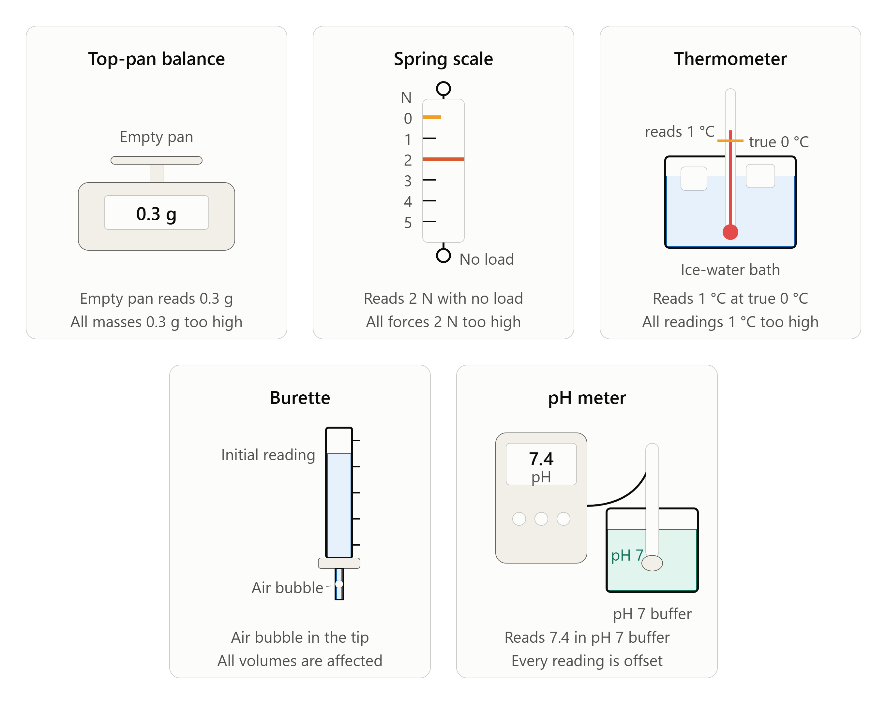

=============
Zero Error
=============

| **Zero error** occurs when an instrument does not read zero when it should before any quantity is applied or measured.
| It is classified as a **systematic error** — it shifts every reading by the same amount in the same direction.

----

----

Examples
------------

* A top-pan balance displaying 0.3 g before any sample is placed on it,
  so every mass reading is 0.3 g too high
* A spring scale reading 2 N with no load applied, so all force
  measurements are 2 N above the true value
* A thermometer reading 1 °C in an ice-water bath that should be 0 °C,
  so all temperature readings are 1 °C too high
* A burette that has a bubble in the tip, so the initial volume reading
  is incorrect and all volume measurements are affected
* A pH meter not calibrated to pH 7 before use, causing all readings to
  be offset by a consistent amount

.. admonition:: Zero Error: A Four-Step Analysis
    :class: premise

    Use the four-step framework to analyse zero error:

    **Step 1 — Identify the source**
        *Instrumental* — the measuring device has a built-in offset that
        is present before any measurement is taken.

    **Step 2 — Classify the behaviour**
        Consistent, one-direction shift → **Systematic error** → affects
        accuracy. Every reading is shifted by the same amount in the same
        direction.

    **Step 3 — Explain the impact**
        All results are shifted too high or too low by the same amount.
        The error cannot be detected by repeating measurements, as every
        repeat is affected equally. Precision is unaffected — results
        will agree with each other — but none will be close to the true
        value.

    **Step 4 — Suggest an improvement**
        Zero errors are eliminated, not averaged out — check and correct
        the instrument before taking any measurements.

----

Effects
----------------

Zero error produces a **consistent offset** across all measurements.
Because every reading is shifted by the same amount in the same direction:

* results will appear **precise** (repeats agree with each other),
* but **accuracy is reduced** — all values are displaced from the true
  value,
* repeating measurements does **not** help, as the error affects every
  reading equally,
* the offset can sometimes be corrected mathematically if the zero error
  value is known and stable.

----

Improvements
------------

To eliminate zero error, check and zero the instrument before use and
verify it is within calibration.

* Check that the instrument reads zero before any measurement is taken;
  adjust using the zero-adjustment screw or tare function if available.
* If the zero error is known and constant, subtract it from all readings
  as a correction factor.
* Re-zero the instrument between trials if it is prone to drift.
* Have the instrument professionally calibrated or replaced if the zero
  error cannot be reliably corrected.

----

Zero Error Quiz
------------------------------------

.. admonition:: Fill in the Gaps — Zero Error
    :class: cloze

    .. cloze::
        :instructions: Complete the following by filling in the missing words.

        1. A zero error occurs when an instrument does not read zero before any quantity is @@measured@@.
        2. Because every reading is shifted by the same amount in the same direction, it is classified as a @@systematic@@ error.
        3. Zero error originates from an @@instrumental@@ source category.
        4. Zero errors reduce the @@accuracy@@ of the results, while precision remains unaffected.
        5. To eliminate zero error, an instrument should be @@zeroed@@ (or tared) before taking any measurements.

----

.. admonition:: Multiple-Choice Questions
    :class: mcq

    Choose the best answer for each question.

    .. tab-set::

        .. tab-item:: Q1

            .. multichoice::

                A digital balance reads **0.3 g** before any object is placed on it. How is this type of error primary classified?

                [ ] Random error
                [x] Systematic error
                [ ] Personal error
                [ ] Environmental variation

        .. tab-item:: Q2

            .. multichoice::

                A spring balance has a zero error that causes all force measurements to be 1.5 N higher than the true value. What effect does this have on the data collected?

                [ ] It reduces the precision of the measurements.
                [x] It reduces the accuracy of the measurements.
                [ ] It increases both the precision and the accuracy.
                [ ] It makes the repeated measurements disagree with each other.

        .. tab-item:: Q3

            .. multichoice::

                A group of students notices their thermometer reads 1.5 °C in an ice-water bath (which should read 0.0 °C). They decide to repeat their experiment five times and average the results. What effect will averaging have on this zero error?

                [ ] It will completely eliminate the zero error.
                [ ] It will reduce the zero error by a factor of five.
                [x] It will not reduce the effect of the zero error.
                [ ] It will convert the zero error into a random error.

        .. tab-item:: Q4

            .. multichoice::

                Which source category from the four-step error framework does a zero error belong to?

                [x] Instrumental
                [ ] Observational / Procedural
                [ ] Method
                [ ] Environmental

        .. tab-item:: Q5

            .. multichoice::

                A balance displays a consistent offset of +0.4 g before weighing any sample. Which of the following is an effective way to correct for this zero error?

                [ ] Increase the sample size and take the average.
                [ ] Read the digital display from eye level to eliminate parallax.
                [x] Press the tare button or mathematically subtract 0.4 g from all readings.
                [ ] Re-read the display multiple times to ensure no transcription mistakes were made.

----

.. admonition:: Structured Question: Zero Error
    :class: shortanswer

    .. structuredquestion:: Zero Error Investigation
        :total-marks: 8
        :category: Systematic Errors

        .. stimulus::
            A Year 8 class is investigating how the mass of a paper cup changes
            when different volumes of water are added to it. Before beginning,
            the teacher instructs students to place the empty cup on the balance
            and record the starting mass. One group notices their balance displays
            **0.4 g** before they place anything on it. They do not adjust the
            balance and proceed to record all their measurements.

        .. tab-set::

            .. tab-item:: Part (a)

                .. subquestion:: Identify the error
                    :marks: 2

                    Identify the type of error present in this investigation and
                    classify it as random, systematic, or personal.

                    .. model-answer::
                        The error is a **zero error**  *(1 mark)*, classified as a **systematic error**  *(1 mark)*.

                    .. marking-guidance::
                        Accept "zero error" or "the balance has not been
                        zeroed." Do not accept "human error" or "mistake" — the balance
                        itself has a fault, so this is an instrumental error, not a
                        personal error.

            .. tab-item:: Part (b)

                .. subquestion:: Effect on measurements
                    :marks: 3

                    Explain how this error would affect the group's mass
                    measurements. In your answer, refer to the direction of the error and
                    its effect on the accuracy and precision of the results.

                    .. model-answer::
                        - Every measurement is consistently **overestimated** by 0.4 g. *(1 mark)*
                        - **Accuracy** is reduced because recorded masses are 0.4 g higher than the true mass. *(1 mark)*
                        - **Precision** is unaffected because the same offset is present in every reading. *(1 mark)*

                    .. marking-guidance::
                        - **Direction:** Award only if overestimation is specified.
                        - **Precision:** Award only if stated as unaffected with valid reasoning.

            .. tab-item:: Part (c)

                .. subquestion:: Repeating measurements
                    :marks: 2

                    The group repeats each measurement three times and calculates
                    a mean. Evaluate whether this would reduce the effect of the error
                    identified in part (a).

                    .. model-answer::
                        - Repeating measurements would **not** reduce the effect of this error. *(1 mark)*
                        - Averaging does not cancel a consistent offset — it only reduces random errors. *(1 mark)*

                    .. marking-guidance::
                        A response that simply states "repeating reduces error" without explaining why it does not apply here should not receive full marks.

            .. tab-item:: Part (d)

                .. subquestion:: Improvement
                    :marks: 1

                    Describe one improvement the group could make to eliminate
                    this error before collecting data.

                    .. model-answer::
                        Use the tare or zero function on the balance to set the display to 0.0 g before placing the cup on it. *(1 mark)*

                    .. marking-guidance::
                        Accept "subtract 0.4 g from all readings as a correction factor".

