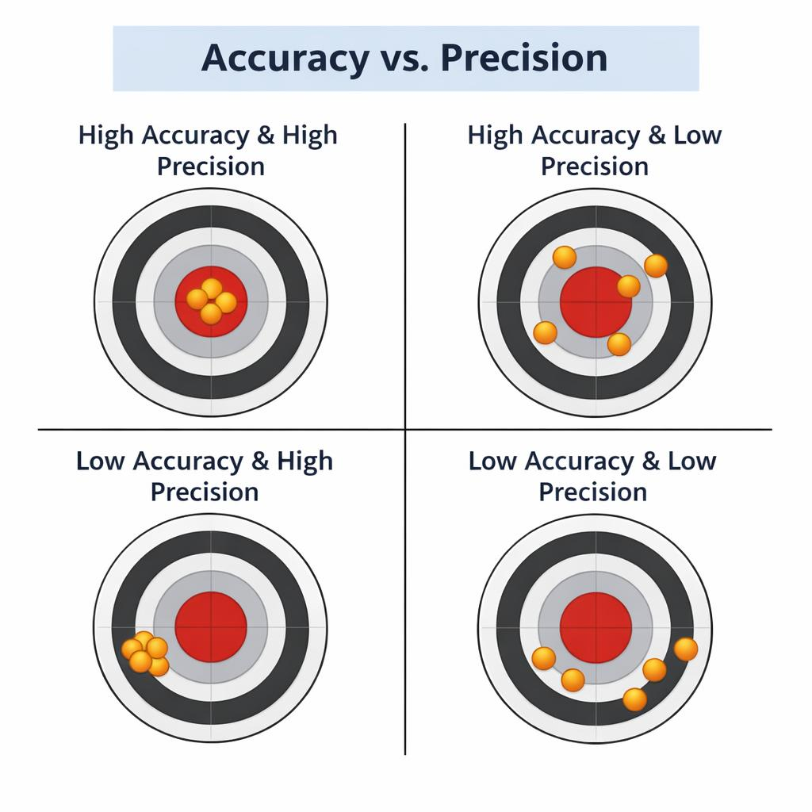

================================================
Accuracy and Precision
================================================

Experimental error is the difference between a measured value and the true or accepted value.

Accuracy describes how close a measurement is to the true value.
A measurement with high accuracy has only a small difference from the true value.

Precision describes how close repeated measurements are to each other.
A set of measurements with high precision shows very little variation between trials.

Accuracy and precision are independent. A result can be accurate but not precise, precise but not accurate, both, or neither. Understanding this distinction helps scientists evaluate the quality of their data and identify sources of error.

----

| **Accuracy** — how close a measurement is to the true or accepted value.
| **Precision** — how close repeated measurements are to each other.

| **High Accuracy + High Precision**
| Example: A 50.00 g mass measured as 49.99 g, 50.01 g, 50.00 g.
| → Correct and consistent.

| **High Accuracy + Low Precision**
| Example: A 25°C water bath measured as 22°C, 27°C, 25°C, 26°C.
| → Correct on average but scattered.

| **Low Accuracy + High Precision**
| Example: A scale with a +5 g zero error measuring 50 g as 55.0 g, 55.1 g.
| → Consistent but wrong (systematic error).

| **Low Accuracy + Low Precision**
| Example: A worn spring balance measuring 200 g as 150 g, 230 g, 180 g, 260 g.
| → Wrong and inconsistent.

----

.. admonition:: Fill in the Gaps — Accuracy and Precision
    :class: cloze

    Complete the following by filling in the missing words.

    **Word list (A → Z):**
    accuracy • high precision • low accuracy • low precision • precision

    1. __________________ describes how close a measurement is to the true or accepted value.

    2. __________________ refers to how close repeated measurements are to each other.

    3. A set of results that are far from the true value shows __________________.

    4. A set of results that are scattered and inconsistent shows __________________.

    5. A measurement that is both correct and consistent demonstrates both high accuracy and __________________.

    .. dropdown:: Reveal Answer Key
        :icon: check-circle
        :class-container: dropdown-cloze

        .. tab-set::

            .. tab-item:: Answers

                1. accuracy
                2. precision
                3. low accuracy
                4. low precision
                5. high precision

----

.. admonition:: Multiple-Choice Questions
    :class: mcq

    Choose the best answer for each question.

    .. tab-set::
        :sync-group: set1

        .. tab-item:: Q1
            :sync: q1

            1. Which situation shows **high accuracy and high precision**?

                | a. Measurements close to the true value and close to each other
                | b. Measurements close to the true value but widely scattered
                | c. Measurements far from the true value but tightly grouped
                | d. Measurements far from the true value and scattered

        .. tab-item:: Q2
            :sync: q2

            2. Which situation shows **high accuracy but low precision**?

                | a. Readings that average to the true value but vary widely
                | b. Readings that are tightly grouped but incorrect
                | c. Readings that are both incorrect and inconsistent
                | d. Readings that are consistently too high due to zero error

        .. tab-item:: Q3
            :sync: q3

            3. Which situation shows **low accuracy but high precision**?

                | a. A ruler with unclear markings producing scattered measurements
                | b. A thermometer giving random values around the true temperature
                | c. A balance giving both correct and incorrect readings at random
                | d. A faulty scale giving consistent readings that are all too high

        .. tab-item:: Q4
            :sync: q4

            4. Which situation shows **low accuracy and low precision**?

                | a. Results that are correct on average but inconsistent
                | b. Results that are consistent but shifted away from the true value
                | c. Results that are neither close to the true value nor to each other
                | d. Results that are correct and repeatable

        .. tab-item:: Q5
            :sync: q5

            5. What type of error most often causes **low accuracy but high precision**?

                | a. Random error
                | b. Systematic error
                | c. Recording error only
                | d. Environmental noise

    .. dropdown:: Reveal Answer Key
        :icon: check-circle
        :class-container: dropdown-mcq

        .. tab-set::
            :sync-group: set1

            .. tab-item:: Q1
                :sync: q1

                1. a — Measurements close to the true value and close to each other

            .. tab-item:: Q2
                :sync: q2

                2. a — Readings that average to the true value but vary widely

            .. tab-item:: Q3
                :sync: q3

                3. d — A faulty scale giving consistent readings that are all too high

            .. tab-item:: Q4
                :sync: q4

                4. c — Results that are neither close to the true value nor to each other

            .. tab-item:: Q5
                :sync: q5

                5. b — Systematic error

