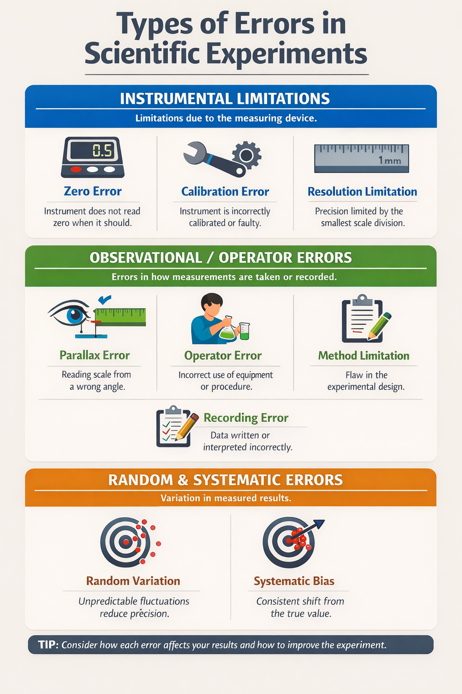

================================================
Errors in Scientific Experiments
================================================

Errors in scientific experiments can be grouped into three main categories to help explain measurement quality:

**Instrumental limitations**
- Limitations due to the measuring device.

.. list-table::
    :header-rows: 1
    :widths: 25 75

    * - Error Type
      - Description

    * - Zero error
      - Occurs when the instrument does not read zero when it should.

    * - Calibration error
      - Occurs when the instrument is incorrectly calibrated or faulty.

    * - Resolution limitation
      - Occurs when precision is limited by the smallest scale division of the instrument.

**Observational / Operator errors**
- Errors due to how measurements are taken or recorded.

.. list-table::
    :header-rows: 1
    :widths: 25 75

    * - Error Type
      - Description

    * - Parallax error
      - Occurs when a scale is read from an incorrect viewing angle.

    * - Operator (technique) error
      - Occurs when equipment is used incorrectly or the procedure is not followed correctly.

    * - Method limitation
      - A limitation in the experimental design (not due to the operator) that introduces bias.

    * - Recording error
      - Occurs when data are written down or interpreted incorrectly.

**Random and Systematic Errors**
- Describe variation in measured results.
-
.. list-table::
    :header-rows: 1
    :widths: 25 75

    * - Error Type
      - Description

    * - Random variation
      - Unpredictable fluctuations between measurements that reduce precision.

    * - Systematic bias
      - A consistent shift in one direction from the true value, affecting accuracy.

----

.. admonition:: Cloze Questions
    :class: questions

    Complete each sentence with the correct verb.

    **Word list (A → Z):**
    align • check • detect • read • repeat

    1. To avoid zero error, researchers must _______________ that the instrument begins at the correct baseline.

    2. To prevent resolution limitations, scientists should _______________ scales with enough precision for the measurement.

    3. To avoid parallax error, students must _______________ the scale from a straight-on viewing angle.

    4. To identify random variation, researchers should _______________ measurements and compare the results.

    5. To recognise systematic bias, scientists must _______________ patterns that consistently shift in one direction.

    .. dropdown::
        :icon: codescan
        :color: primary

        .. tab-set::

            .. tab-item:: Answers

                1. check
                2. read
                3. align
                4. repeat
                5. detect

----

.. admonition:: Multiple-Choice Questions
    :class: questions

    Choose the best answer for each question.

    1. A balance consistently reads 0.05 g when empty. What type of error is this?

        | a. Calibration error
        | b. Zero error
        | c. Random variation
        | d. Recording error

    2. A ruler marked only in centimetres is used to measure a small object. What is the main limitation?

        | a. Zero error
        | b. Resolution limitation
        | c. Systematic bias
        | d. Operator error

    3. A student reads a measuring cylinder from above instead of at eye level. What error is introduced?

        | a. Recording error
        | b. Calibration error
        | c. Parallax error
        | d. Random variation

    4. An experiment is designed so that heat is lost to the surroundings in every trial, even when performed correctly. What best describes this issue?

        | a. Operator error
        | b. Method limitation
        | c. Random variation
        | d. Recording error

    5. Repeated measurements of the same quantity vary slightly above and below the true value. What does this indicate?

        | a. Systematic bias
        | b. Calibration error
        | c. Random variation
        | d. Zero error

    6. All measurements in an experiment are consistently higher than the true value. What is the most likely explanation?

        | a. Random variation
        | b. Recording error
        | c. Systematic bias
        | d. Resolution limitation

    .. dropdown::
        :icon: codescan
        :color: primary

        .. tab-set::

            .. tab-item:: Answers

                1. b — Zero error
                2. b — Resolution limitation
                3. c — Parallax error
                4. b — Method limitation
                5. c — Random variation
                6. c — Systematic bias

